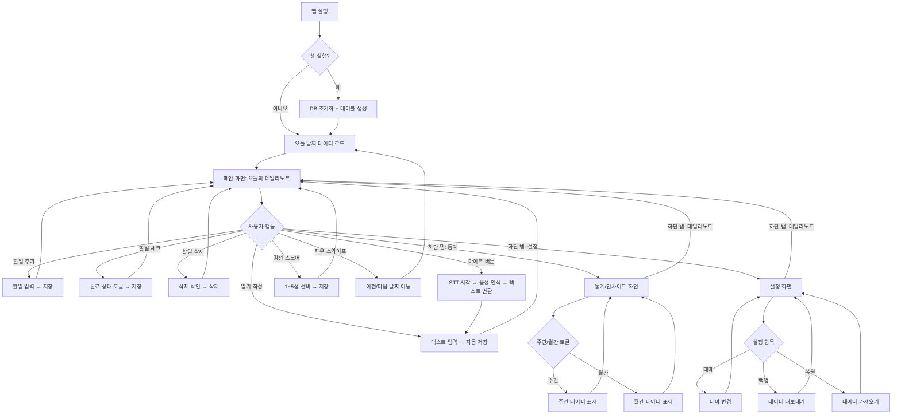
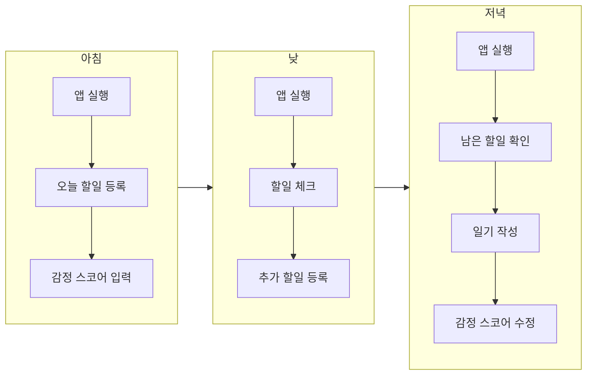
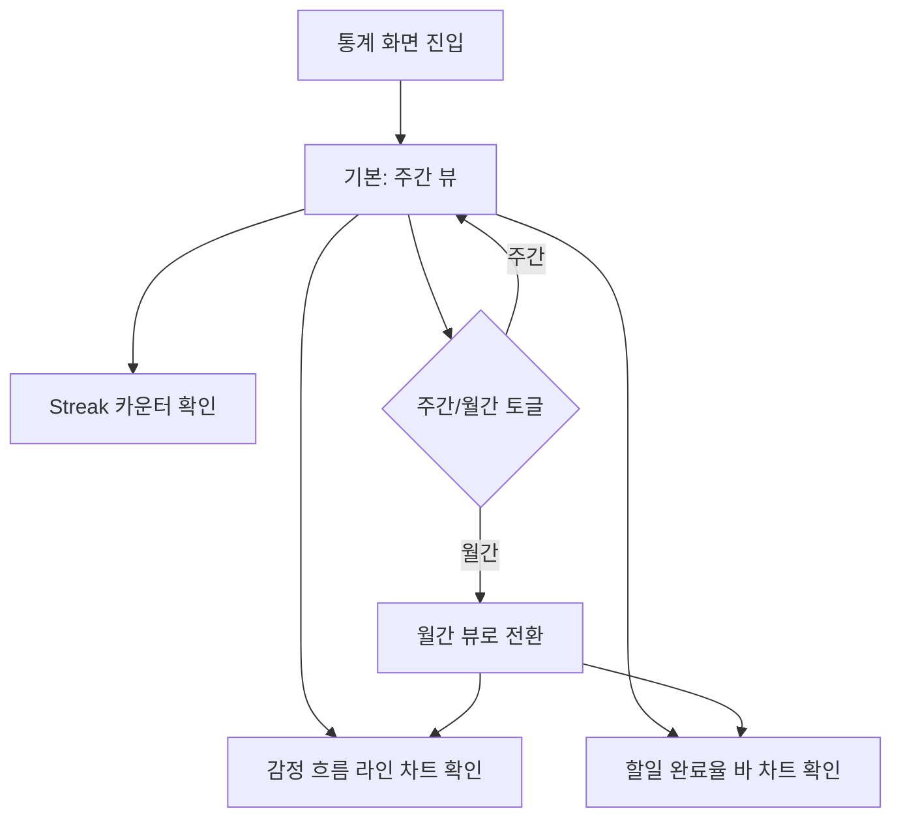
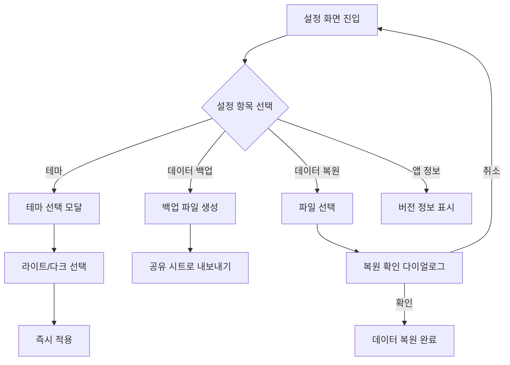
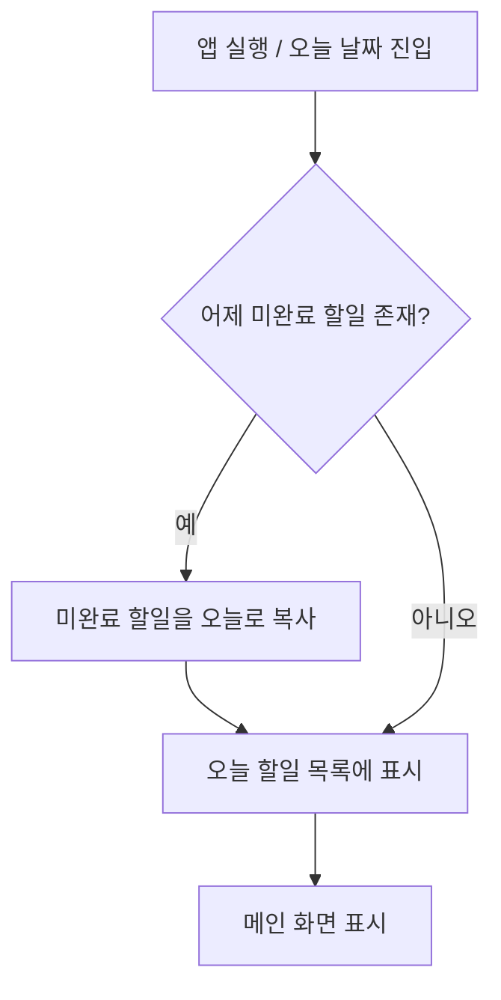
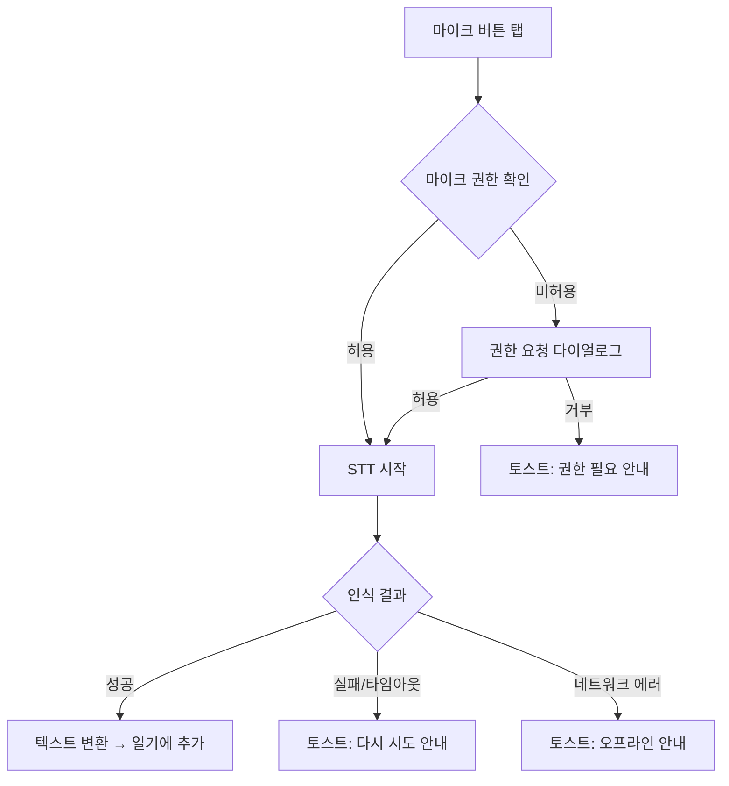
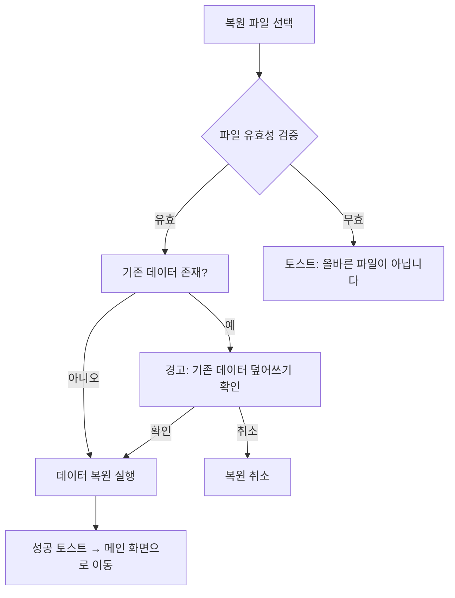

# User Flow

## 1. 전체 플로우 (Mermaid)

## 2. 화면별 플로우

### 2.1 오늘의 데일리노트 (메인 화면)

#### 진입 경로
- 앱 실행 시 기본 진입
- 하단 탭 "데일리노트" 탭
- 다른 화면에서 탭 전환

#### 사용자 행동 플로우

#### 상세 행동
| 행동 | 트리거 | 결과 | 저장 |
|------|--------|------|------|
| 할일 추가 | 추가 버튼 탭 | 입력 필드 표시 → 텍스트 입력 → 확인 | 즉시 DB 저장 |
| 할일 체크 | 체크박스 탭 | 완료/미완료 토글 | 즉시 DB 저장 |
| 할일 삭제 | 스와이프 또는 길게 누르기 | 삭제 확인 → 삭제 | 즉시 DB 저장 |
| 일기 작성 | 일기 영역 탭 | 키보드 표시 → 텍스트 입력 | 1초 디바운스 자동 저장 |
| 음성 입력 | 마이크 버튼 탭 | STT 시작 → 텍스트 변환 → 일기에 추가 | 변환 완료 후 자동 저장 |
| 감정 입력 | 점수 영역 탭 | 1~5점 선택 | 즉시 DB 저장 |
| 날짜 이동 | 좌우 스와이프 | 이전/다음 날짜 데이터 로드 | - |

#### 이탈 경로
- 하단 탭으로 다른 화면 이동
- 앱 백그라운드/종료 (자동 저장 완료 상태)

### 2.2 통계/인사이트 화면

#### 진입 경로
- 하단 탭 "통계" 탭

#### 사용자 행동 플로우

#### 이탈 경로
- 하단 탭으로 다른 화면 이동

### 2.3 설정 화면

#### 진입 경로
- 하단 탭 "설정" 탭

#### 사용자 행동 플로우

#### 이탈 경로
- 하단 탭으로 다른 화면 이동

## 3. 예외 플로우

### 3.1 미완료 할일 자동 이월

### 3.2 STT 오류 처리

### 3.3 데이터 복원 충돌

### 3.4 빈 날짜 처리

- 감정 스코어: 미입력 시 빈 상태로 표시 (기본값 없음)
- 할일: 빈 목록 표시 + "할일을 추가해보세요" 안내 문구
- 일기: 빈 텍스트 영역 표시 (플레이스홀더: "오늘 하루는 어땠나요?")
- 통계 차트: 데이터 없는 날은 빈 포인트로 표시
