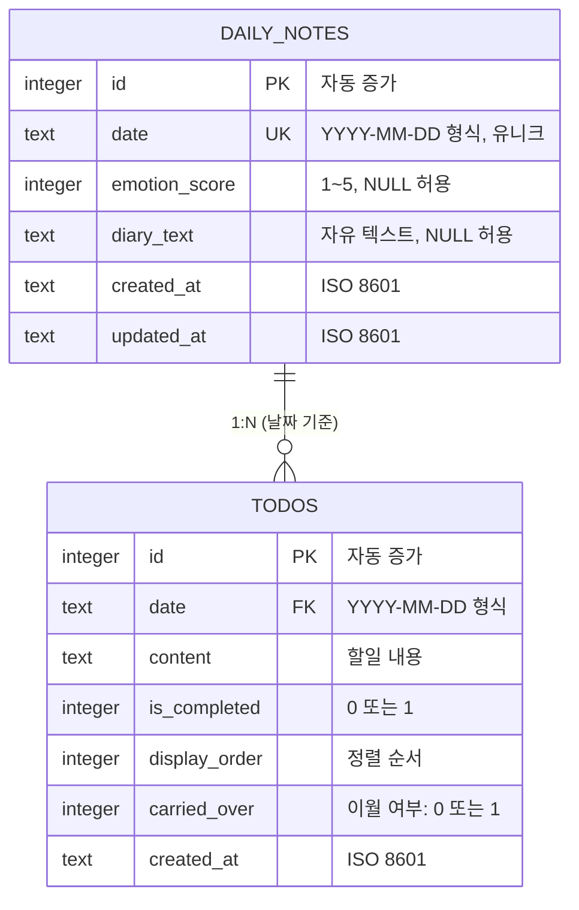

# Database Design (SQLite)

## 1. ERD (Entity Relationship Diagram)



## 2. 테이블 정의

### 2.1 daily_notes (일일 노트)

하루 단위의 감정 스코어와 일기 내용을 저장한다.

```sql
CREATE TABLE IF NOT EXISTS daily_notes (
    id            INTEGER PRIMARY KEY AUTOINCREMENT,
    date          TEXT    NOT NULL UNIQUE,
    emotion_score INTEGER CHECK (emotion_score BETWEEN 1 AND 5),
    diary_text    TEXT    DEFAULT '',
    created_at    TEXT    NOT NULL DEFAULT (datetime('now', 'localtime')),
    updated_at    TEXT    NOT NULL DEFAULT (datetime('now', 'localtime'))
);
```

| 컬럼 | 타입 | 제약 조건 | 설명 |
|------|------|-----------|------|
| id | INTEGER | PK, AUTOINCREMENT | 고유 식별자 |
| date | TEXT | NOT NULL, UNIQUE | 날짜 (YYYY-MM-DD) |
| emotion_score | INTEGER | CHECK (1~5), NULL 허용 | 감정 점수 |
| diary_text | TEXT | DEFAULT '' | 일기 내용 |
| created_at | TEXT | NOT NULL | 생성 시각 |
| updated_at | TEXT | NOT NULL | 수정 시각 |

### 2.2 todos (할일)

날짜별 할일 목록을 저장한다.

```sql
CREATE TABLE IF NOT EXISTS todos (
    id            INTEGER PRIMARY KEY AUTOINCREMENT,
    date          TEXT    NOT NULL,
    content       TEXT    NOT NULL,
    is_completed  INTEGER NOT NULL DEFAULT 0 CHECK (is_completed IN (0, 1)),
    display_order INTEGER NOT NULL DEFAULT 0,
    carried_over  INTEGER NOT NULL DEFAULT 0 CHECK (carried_over IN (0, 1)),
    created_at    TEXT    NOT NULL DEFAULT (datetime('now', 'localtime'))
);
```

| 컬럼 | 타입 | 제약 조건 | 설명 |
|------|------|-----------|------|
| id | INTEGER | PK, AUTOINCREMENT | 고유 식별자 |
| date | TEXT | NOT NULL | 소속 날짜 (YYYY-MM-DD) |
| content | TEXT | NOT NULL | 할일 내용 |
| is_completed | INTEGER | NOT NULL, CHECK (0,1) | 완료 여부 |
| display_order | INTEGER | NOT NULL, DEFAULT 0 | 표시 순서 |
| carried_over | INTEGER | NOT NULL, CHECK (0,1) | 이월 여부 |
| created_at | TEXT | NOT NULL | 생성 시각 |

## 3. 인덱스

```sql
-- daily_notes: 날짜 기반 빠른 조회
CREATE INDEX IF NOT EXISTS idx_daily_notes_date
    ON daily_notes (date);

-- todos: 날짜 기반 빠른 조회
CREATE INDEX IF NOT EXISTS idx_todos_date
    ON todos (date);

-- todos: 날짜 + 정렬 순서 복합 인덱스
CREATE INDEX IF NOT EXISTS idx_todos_date_order
    ON todos (date, display_order);

-- todos: 미완료 할일 조회 (자동 이월용)
CREATE INDEX IF NOT EXISTS idx_todos_incomplete
    ON todos (date, is_completed)
    WHERE is_completed = 0;
```

## 4. 제약 조건 및 규칙

### 4.1 데이터 무결성

- `daily_notes.date`는 UNIQUE -- 하루에 하나의 노트만 존재
- `daily_notes.emotion_score`는 NULL 허용 -- 감정 미입력 시
- `todos.content`는 빈 문자열 불가 -- NOT NULL
- `todos.is_completed`와 `carried_over`는 0 또는 1만 허용

### 4.2 날짜 형식

- 모든 날짜는 `YYYY-MM-DD` 형식 (예: `2026-04-28`)
- 타임스탬프는 ISO 8601 형식 (예: `2026-04-28T09:30:00`)
- 로컬 타임존 기준

### 4.3 자동 이월 로직

```sql
-- 어제 미완료 할일을 오늘로 이월하는 쿼리
INSERT INTO todos (date, content, is_completed, display_order, carried_over)
SELECT
    :today_date,
    content,
    0,
    display_order,
    1
FROM todos
WHERE date = :yesterday_date
  AND is_completed = 0
  AND id NOT IN (
      SELECT id FROM todos WHERE date = :today_date AND carried_over = 1
  );
```

## 5. 주요 쿼리

### 5.1 오늘의 데이터 로드

```sql
-- 오늘의 노트 조회
SELECT * FROM daily_notes WHERE date = :date;

-- 오늘의 할일 조회 (순서대로)
SELECT * FROM todos WHERE date = :date ORDER BY display_order ASC;
```

### 5.2 감정 스코어 저장/업데이트

```sql
-- UPSERT: 없으면 생성, 있으면 업데이트
INSERT INTO daily_notes (date, emotion_score, updated_at)
VALUES (:date, :score, datetime('now', 'localtime'))
ON CONFLICT(date) DO UPDATE SET
    emotion_score = :score,
    updated_at = datetime('now', 'localtime');
```

### 5.3 일기 저장/업데이트

```sql
INSERT INTO daily_notes (date, diary_text, updated_at)
VALUES (:date, :text, datetime('now', 'localtime'))
ON CONFLICT(date) DO UPDATE SET
    diary_text = :text,
    updated_at = datetime('now', 'localtime');
```

### 5.4 통계 데이터 조회

```sql
-- 주간 감정 흐름 (최근 7일)
SELECT date, emotion_score
FROM daily_notes
WHERE date BETWEEN :start_date AND :end_date
ORDER BY date ASC;

-- 주간 할일 완료율
SELECT
    date,
    COUNT(*) as total,
    SUM(is_completed) as completed,
    ROUND(CAST(SUM(is_completed) AS FLOAT) / COUNT(*) * 100, 1) as completion_rate
FROM todos
WHERE date BETWEEN :start_date AND :end_date
GROUP BY date
ORDER BY date ASC;

-- 연속 기록일 (Streak) 계산
WITH RECURSIVE streak AS (
    SELECT date FROM daily_notes WHERE date = :today
    UNION ALL
    SELECT dn.date
    FROM daily_notes dn
    INNER JOIN streak s ON dn.date = date(s.date, '-1 day')
)
SELECT COUNT(*) as streak_count FROM streak;
```

### 5.5 데이터 백업/복원

```sql
-- 전체 데이터 내보내기 (JSON 변환은 앱 레이어에서 처리)
SELECT * FROM daily_notes ORDER BY date;
SELECT * FROM todos ORDER BY date, display_order;
```

## 6. 마이그레이션 전략

- 버전 1 (MVP): 위 테이블 구조 그대로 사용
- 향후 스키마 변경 시 `PRAGMA user_version`을 활용한 마이그레이션
- 마이그레이션 스크립트는 `services/database.ts`에서 앱 시작 시 실행

```typescript
// 마이그레이션 예시
const DB_VERSION = 1;

async function migrate(db: SQLiteDatabase) {
  const { user_version } = await db.getFirstAsync<{ user_version: number }>(
    'PRAGMA user_version'
  );

  if (user_version < 1) {
    // 초기 테이블 생성
    await db.execAsync(CREATE_TABLES_SQL);
    await db.execAsync('PRAGMA user_version = 1');
  }

  // if (user_version < 2) { ... } -- 향후 마이그레이션
}
```
